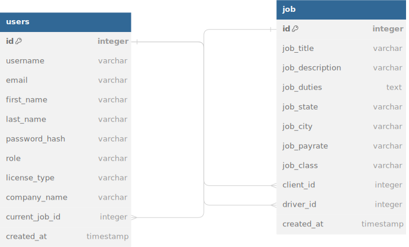

# Capstone Project - Custom API Web Scraper

## Introduction

This project is a part of the Software Engineering Career Track course as it is my Capstone I. It involves the development of a custom web scraper that extracts data from a website and presents it as an API. This README file provides an overview of the project, its functionalities, and how to use it.

For this project I wanted to take hand at creating my own API from an external website. [ProDrivers](http://www.prodrivers.com/)

API

```api
https://www.prodrivers.com/jobs/?_city={city_param}&_state={state_param}&_title={key_param}
```

You can view the deployed application here: [Prodrivers - Webcrawl](https://prodrivers-webcrawl.onrender.com/)

## Project Overview

### Description

The Capstone Part I project focuses on building a custom API using web scraping techniques. The API is designed to retrieve data from a specific website and format it in a way that's easily accessible for other applications.

### Features

- Web scraping using BeautifulSoup4 and Requests libraries.
- Conversion of scraped data into a custom API.
- Clean and structured API responses.
- Easy installation via pip or using a requirements.txt file.
- Create a User (With various roles and permissions)
- Login/Logout
- Create Additional Jobs that are not apart of API

### Userflow

- You may search for jobs without logging in
- If you 'Sign Up' then you can choose a role 'Driver', 'Dispatcher' and 'Client'
- As far as the relations go:


### Technology Stack

- Python
- BeautifulSoup4
- Requests
- Flask
- Jinja2
  
## Installation

You can install the required libraries for this project using pip. Simply run the following command inside the local directory of the project:

```bash
python3 -m venv venv
source venv/bin/activate
pip install -r requirements.txt
flask run
```

If for any reason 'pip install -r requirements.txt' fails you may copy the entire contents of the [post_requirements_manual.md](post_requirements_manual.md)
file into your terminal.

## Running the Web Scrapes

To run the web scraper and obtain API responses, execute the following command:

```bash
python webcrawl.py
```

This command will initiate the scraping process, and you should see a list of retrieved data items presented as a custom API JSON object.

## Usage

### Standard User Flow

1. Install the required dependencies using the installation instructions provided above.

2. Run the web scraper using the command `python webcrawl.py`.

3. Access the custom API generated by the scraper to retrieve data.

4. Use the obtained data in your applications as needed.

### Developer Notes

- After installing any additional packages, make sure to update the `requirements.txt` file with the command:

```bash
pip freeze > requirements.txt
```

## Additional Information

- The project's GitHub repository contains all the code and documentation.
- For details on the specific API endpoints and data structure, refer to the API documentation in the code.

This project is a demonstration of web scraping techniques and creating custom APIs. It can be extended and modified to suit various data extraction needs.